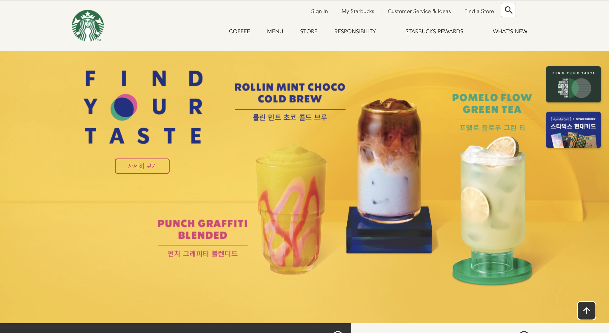
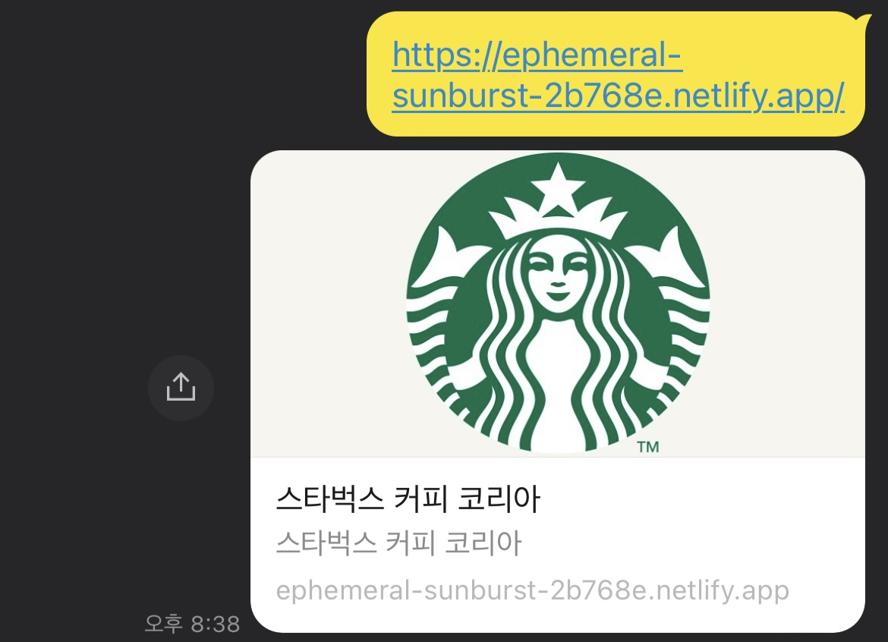

# STARBUCKS ☕

[사이트 이동](https://ephemeral-sunburst-2b768e.netlify.app/)




# 뷰포트(Viewport) 렌더링 방식 설정

웹페이지가 화면(Viewport)에 표현되는 방식을 설정합니다.<br/>모바일 환경에서 적용된다.

```html
<meta name="viewport" content="width=device-width, initial-scale=1.0" />
```
- 
`width=device-width`: 화면의 가로 너비를 각 디바이스(Device)의 가로 너비와 동일하게 적용
- `initial-scale=1.0`: 화면의 초기 화면 배율(확대 정도)을 설정
- `user-scalable=no`: 사용자가 디바이스 화면을 확대(yes)/축소(no)할 수 있는지 설정
- `maximum-scale=1`: 사용자가 화면을 확대할 수 있는 최댓값
- `minimum-scale=1`: 사용자가 화면을 축소할 수 있는 최솟값


# 오픈 그래프(The Open Graph protocol)
웹페이지가 소셜 미디어로 공유될 때 우선적으로 활용되는 정보를 지정한다.



```html
<meta property="og:type" content="website" />
<meta property="og:site_name" content="Starbucks" />
<meta property="og:title" content="Starbucks Coffee Korea" />
<meta property="og:description" content="스타벅스는 세계에서 가장 큰 다국적 커피 전문점으로, 64개국에서 총 23,187개의 매점을 운영하고 있습니다." />
<meta property="og:image" content="./images/starbucks_seo.jpg" />
<meta property="og:url" content="https://starbucks.co.kr" />
```
- `og:type`: 페이지의 유형(E.g, website, video.movie)
- `og:site_name`: 속한 사이트의 이름
- `og:title`: 페이지의 이름(제목)
- `og:description`: 페이지의 간단한 설명
- `og:image`: 페이지의 대표 이미지 주소(URL)
- `og:url`: 페이지 주소(URL)

# 트위터 카드(Twitter Cards)
웹페이지가 소셜 미디어(트위터)로 공유될 때 우선적으로 활용되는 정보를 지정한다.

```html
<meta property="twitter:card" content="summary" />
<meta property="twitter:site" content="Starbucks" />
<meta property="twitter:title" content="Starbucks Coffee Korea" />
<meta property="twitter:description" content="스타벅스는 세계에서 가장 큰 다국적 커피 전문점으로, 64개국에서 총 23,187개의 매점을 운영하고 있습니다." />
<meta property="twitter:image" content="./images/starbucks_seo.jpg" />
<meta property="twitter:url" content="https://starbucks.co.kr" />
```

- `twitter:card`: 페이지(카드)의 유형(E.g. summary, player)
- `twitter:site`: 속한 사이트의 이름
- `twitter:title`: 페이지의 이름(제목)
- `twitter:description`: 페이지의 간단한 설명
- `twitter:image`: 페이지의 대표 이미지 주소(URL)
- `twitter:url`: 페이지 주소(URL)

# GSAP & ScrollToPlugin
[GSAP(The GreenSock Animation Platform)](https://greensock.com/gsap/)은 자바스크립트로 제어하는 타임라인 기반의 애니메이션 라이브러리이다. [ScrollToPlugin](https://greensock.com/scrolltoplugin/)은 스크롤 애니메이션을 지원하는 GSAP 플러그인이다.
```javascript
<script src="https://cdnjs.cloudflare.com/ajax/libs/gsap/3.5.1/gsap.min.js" integrity="sha512-IQLehpLoVS4fNzl7IfH8Iowfm5+RiMGtHykgZJl9AWMgqx0AmJ6cRWcB+GaGVtIsnC4voMfm8f2vwtY+6oPjpQ==" crossorigin="anonymous"></script>
<script src="https://cdnjs.cloudflare.com/ajax/libs/gsap/3.5.1/ScrollToPlugin.min.js" integrity="sha512-nTHzMQK7lwWt8nL4KF6DhwLHluv6dVq/hNnj2PBN0xMl2KaMm1PM02csx57mmToPAodHmPsipoERRNn4pG7f+Q==" crossorigin="anonymous"></script>
```
[.to() 사용법](https://greensock.com/docs/v3/GSAP/gsap.to())[GSAP Easing](https://greensock.com/docs/v2/Easing)

```javascript
gsap.to(요소, 시간, 옵션)
// 또는
TweenMax.to(요소, 시간, 옵션)
```
```javascript
gsap.to(window, .7, {
  scrollTo: 0
});
```

# Swiper
[Swiper](https://swiperjs.com/)는 하드웨어 가속 전환과 여러 기본 동작을 갖춘 현대적인 슬라이드 라이브러리.

[Getting Started With](Swiperhttps://swiperjs.com/get-started)

```html
<!-- in HEAD -->
<link rel="stylesheet" href="https://unpkg.com/swiper/swiper-bundle.min.css" />
<script src="https://unpkg.com/swiper/swiper-bundle.min.js"></script>

<!-- in BODY -->
<div class="swiper-container">
  <div class="swiper-wrapper">
    <div class="swiper-slide">1</div>
    <div class="swiper-slide">2</div>
    <div class="swiper-slide">3</div>
  </div>
</div>
```
[Swiper API](https://swiperjs.com/swiper-api)(옵션)
```javascript
new Swiper(요소, 옵션);
```
```javascript
new Swiper('.swiper-container', {
  direction: 'vertical', // 수직 슬라이드
  autoplay: true, // 자동 재생 여부
  loop: true // 반복 재생 여부
});
```

# Youtube API
[IFrame Player API](https://developers.google.com/youtube/iframe_api_reference?hl=ko)를 통해 YouTube 동영상 이용.

유튜브 영상이 출력될 위치에 요소를 지정(생성).
```html
<!-- in HEAD -->
<script defer src="./js/youtube.js"></script>

<!-- in BODY -->
<div id="player"></div>
```
`onYouTubePlayerAPIReady` 함수 이름은 Youtube IFrame Player API에서 사용하는 이름이기 때문에 다르게 지정하면 동작하지 않는다.

```javascript
// Youtube IFrame API를 비동기로 로드합니다.
var tag = document.createElement('script');
tag.src = "https://www.youtube.com/iframe_api";
var firstScriptTag = document.getElementsByTagName('script')[0];
firstScriptTag.parentNode.insertBefore(tag, firstScriptTag);

function onYouTubePlayerAPIReady() {
  // <div id="player"></div>
  new YT.Player('player', {
    videoId: 'An6LvWQuj_8', // 재생할 유튜브 영상 ID
    playerVars: {
      autoplay: true, // 자동 재생 유무
      loop: true, // 반복 재생 유무
      playlist: 'An6LvWQuj_8' // 반복 재생할 유튜브 영상 ID 목록
    },
    events: {
      // 영상이 준비되었을 때,
      onReady: function (event) {
        event.target.mute(); // 음소거!
      }
    }
  });
}
```
# ScrollMagic
[ScrollMagic](https://github.com/janpaepke/ScrollMagic)은 스크롤과 요소의 상호 작용을 위한 자바스크립트 라이브러리이다.
대표적으로 어떤 요소가 현재 화면에 보이는 상태인지를 확인할 때 사용한다.

[ScrollMagic API](http://scrollmagic.io/docs/)

```html
<script src="https://cdnjs.cloudflare.com/ajax/libs/ScrollMagic/2.0.8/ScrollMagic.min.js"></script>
```
```javascript
new ScrollMagic
  .Scene({ // 감시할 장면(Scene)을 추가
    triggerElement: spyEl, // 보여짐 여부를 감시할 요소를 지정
    triggerHook: .8 // 화면의 80% 지점에서 보여짐 여부 감시
  })
  .setClassToggle(spyEl, 'show') // 요소가 화면에 보이면 show 클래스 추가
  .addTo(new ScrollMagic.Controller()) // 컨트롤러에 장면을 할당(필수!)
```

# 랜덤한 숫자를 생성하는 함수
```javascript
// 범위 랜덤 함수(소수점 2자리까지)
function random(min, max) {
  // `.toFixed()`를 통해 반환된 문자 데이터를,
  // `parseFloat()`을 통해 소수점을 가지는 숫자 데이터로 변환
  return parseFloat((Math.random() * (max - min) + min).toFixed(2))
}
```